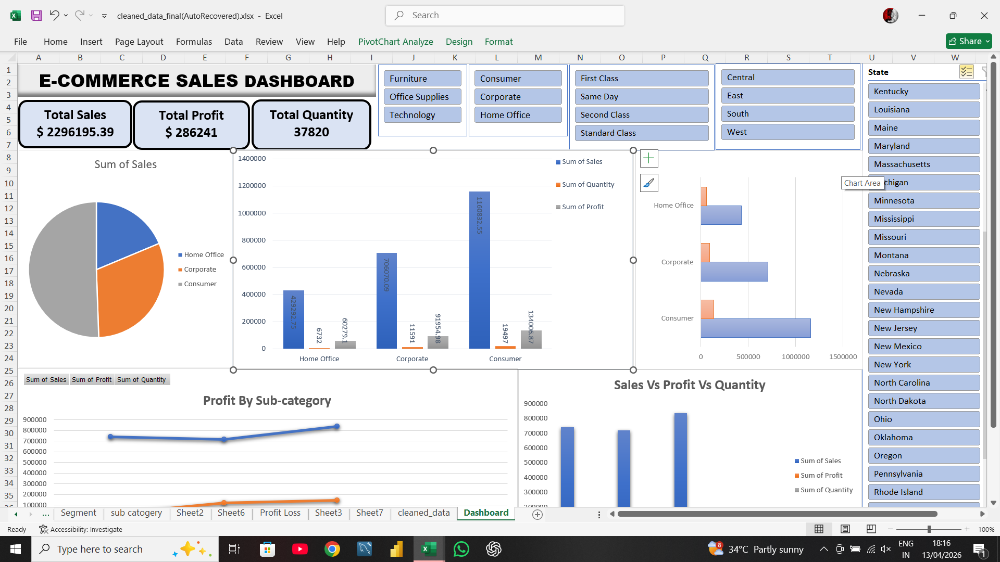

# 📊 E-Commerce Sales & Customer Insights Dashboard

## 🔍 Project Overview

This project analyzes e-commerce sales data using Excel, SQL, and Power BI.

## 🛠 Tools Used

* Excel
* SQL
* Power BI

## 📈 Key Insights

* Technology category has highest sales
* Some sub-categories generate losses
* Regional performance varies

## 📊 Dashboard

### Power BI

### Excel

## 🚀 Conclusion

This project demonstrates complete data analytics workflow.

